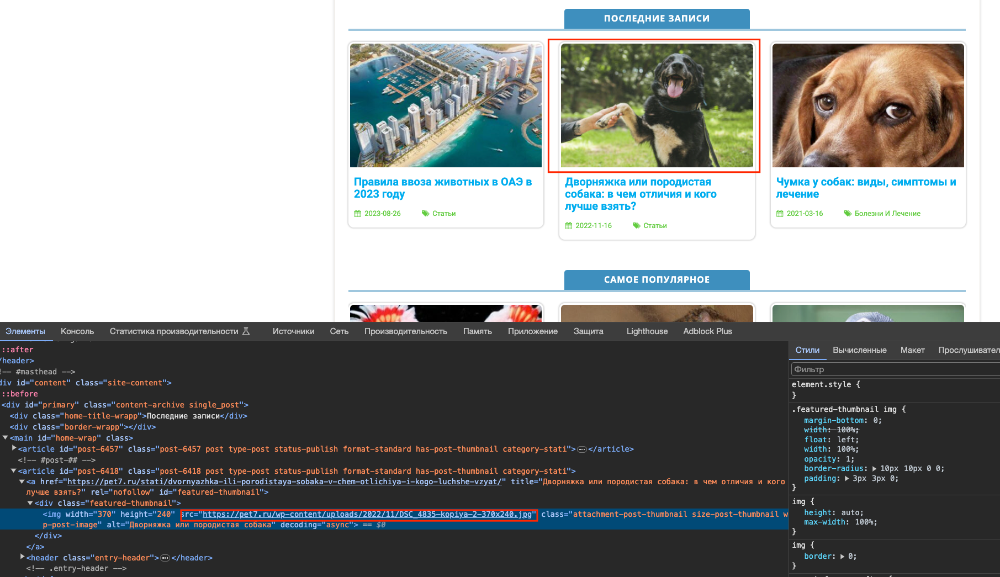

# Домашнее задание - Семинар 1

### Задача 1 - Определите, на каком протоколе работает сайт.
Сайт работает по защищенному протоколу https:

### Задача 2 - Проанализируйте структуру страницы сайта. Покажите в коде где хедер, футер и контент.
Header

Content

Footer

### Задача 3 - Внесите не менее 3 изменений на страницу с помощью инструмента разработчика и представьте скриншоты было/стало.

Изменение 1:

было

стало

Изменение 2:

было

стало

Изменение3:

было

стало

### Задача 4 - Создайте прототип низкой детализации.

Сделано в Figma

Сдайте в виде zip-архива со скриншотами результатов, назовите файл по смыслу работы. ИЛИ можете использовать сервис https://www.notion.so/ или в идеале гит.
### Задача 5 - Зарегистрируйтесь на хостинге.

Выполнил
